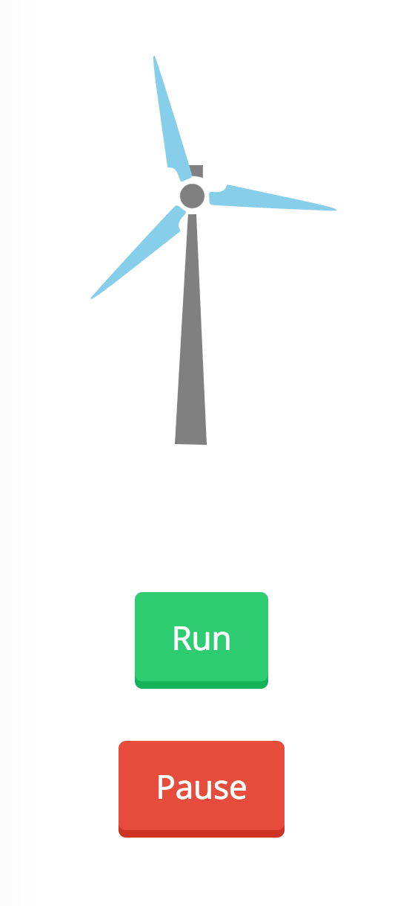

# web-demo-raphael-windturbine

This demo uses Raphael.js to animate a wind turbine with simple run/pause control. It was developed as an interesting way to learn the basics of Raphael.js, based on the following tutorial:  
<a href="https://speckyboy.com/creating-responsive-interactive-animations-raphael-js-2/">https://speckyboy.com/creating-responsive-interactive-animations-raphael-js-2/</a>  
  
The wind turbine "model" used in the demonstration was edited to be more graphically representative of an actual wind turbine. It was modified in an SVG editor (Inkscape), and the various element paths were copied and then reconstructed in Javascript using Raphael.js. Additionally, Raphael.js animations were used to simulate a basic inertia slow-down effect on pausing.

